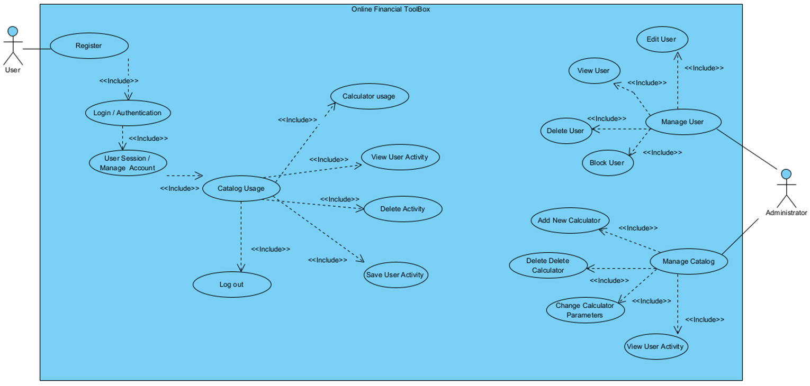
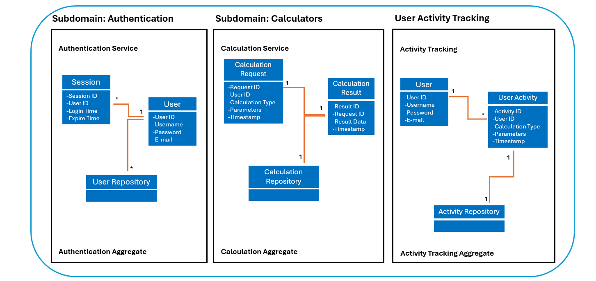

# Finance Application Documentation (FinanceTB)

[](http://www.apache.org/licenses/LICENSE-2.0.html)


#### Contents:
- [Analysis](#analysis)
    - [Scenario](#scenario)
    - [User Stories](#user-stories)
    - [Use Case](#use-case)
- [Design](#design)
    - [Wireframe](#wireframe)
    - [Prototype Design](#prototype-design)
    - [Domain Design](#domain-design)
    - [Business Logic](#business-logic)
- [Implementation](#implementation)
    - [Backend Technology](#backend-technology)
    - [Frontend Technology](#frontend-technology)
- [Execution](#execution)
    - [Backend Execution](#backend-execution)
    - [Frontend Execution](#frontend-execution)
    - [Swagger Documentation](#swagger-documentation)
- [Deployment](#deployment)
- [Project Management](#project-management)
    - [Roles](#roles)
    - [Milestones](#milestones)
    - [Next Steps](#next-steps)
- [Architecture](#architecture)
- [Issues and Bugs](#issues-and-bugs)
- [License](#license)

## Analysis
> 🚧: You can reuse the analysis (you made) from other projects (e.g., requirement engineering), but it must be submitted according to the following template.


### Scenario

The Finance Application is designed to provide financial management tools for users, allowing them to plan for retirement, calculate mortgage payments, manage investments, track loans, and create emergency funds.

An online tool that provides you with easy, reliable and effective calculators that will support you in your daily life.

Whether you're contemplating a home purchase, investment decisions, or considering a loan, rely on Financial ToolBox to streamline your calculations, export results, and even compare them with bank or consultant estimates – all conveniently accessible in one location, and completely free!

### User Stories
1. As an Admin, I want to have a Web app to use on different mobile devices and desktop computers.
2. As an Admin, I want to see a consistent visual appearance to navigate easily, and it should look consistent.
3. As an Admin, I want to use list views to explore and read my business data.
4. As an Admin, I want to use edit and create views to maintain my business data.
5. As an Admin, I want to log-in so that I can authenticate myself.
6. As a User, I want to use list views so that I can access public pages.

### Use Case



- UC-1 [User Registration)]: User provides name, email, and password and system stores user information in the User database
- UC-2 [Calculator Usage]: User selects a specific calculator (mortgage, loan, pension etc.), and inputs parameters for the calculation 
- UC-3 [User Authentication]: User provides email and password, system verifies the credentials against the User database.
- UC-4 [View User Activity]: User can retrieve past calculations activities 

## Design

The design of the FinanceTB application emphasizes a modern and user-friendly interface, utilizing the NextUI library for UI components. Our color scheme is predominantly black, white, and Adobe blue, ensuring a clean and professional look.

NextUI Integration
NextUI is a React-based library that provides a range of customizable components designed to enhance the visual appeal and functionality of our web application. Here's a brief overview of how NextUI is integrated into our project:

Buttons: Customizable buttons for various actions.
Forms: User-friendly forms for input and submission.
Modals: Elegant modals for alerts and pop-ups.
Cards: Stylish cards for displaying user information and financial data.
For more information on NextUI components, visit the NextUI Documentation.


### Wireframe
Our initial wireframe was created using Figma. This wireframe served as the blueprint for our application's layout and design. The wireframe includes the homepage, user dashboard, calculator pages, and authentication screens.

Color Scheme: Black, white, and Adobe blue.
Figma Wireframe: Figma Wireframe Link 

Starting from the home page, we can visit different pages. Available public pages are visible in the menu...

### Prototype
The prototype was developed to visualize the user interface and gather feedback before full-scale development. It included placeholder text and figures and was created using Figma.

- Prototype Features:
- User-friendly interface
- Consistent visual appearance
- Navigation across different pages

- The application features a user-friendly interface with forms for inputting financial data.
- Consistent visual appearance and navigation across different pages for ease of use.

### Domain Design
Our domain model is depicted using UML class diagrams, created in Visual Paradigm. The key entities include User, Investment, Loan, Mortgage, EmergencyFund, and RetirementPlan.

- Domain objects include User, Investment, Loan, Mortgage, EmergencyFund, and RetirementPlan.
- Relationships are established between entities to represent user ownership of financial data.

- The `FTbackend.finance.data.domain` package contains the following domain objects / entities including getters and setters:



### Business Logic

Based on the UC-2, there will be five types of calculation offered to the user. 

When the endpoint is accessed with the specified path and method, and the type parameter is set to "mortgage", the backend service retrieves the necessary input data required for mortgage calculations.

The service then performs various calculations based on the input data to determine key metrics such as monthly mortgage payments, total interest paid over the loan term, and the total cost of the mortgage.

Once the calculations are complete, the service returns the results in a structured format, typically in JSON, containing the calculated metrics.

**Path**: [`/api/users/profile"`]

**Path**: [`/api/calculators/?type="mortgage"`]

**Param**: `value="type"` Admitted value: "mortgage", "investment", "loan", "retirement", "emergencyfund".

**Method:** `GET`

## Implementation
- Backend Technology: Spring Boot, Spring Data JPA, H2 Database
  (ABDU)

### Backend Technology

This Web application is relying on [Spring Boot](https://projects.spring.io/spring-boot) and the following dependencies:

- [Spring Boot](https://projects.spring.io/spring-boot)
- [Spring Data](https://projects.spring.io/spring-data)
- [Java Persistence API (JPA)](http://www.oracle.com/technetwork/java/javaee/tech/persistence-jsp-140049.html)
- [H2 Database Engine](https://www.h2database.com)

To bootstrap the application, the [Spring Initializr](https://start.spring.io/) has been used.

Then, the following further dependencies have been added to the project `pom.xml`:

- DB:
```XML
<dependency>
			<groupId>com.h2database</groupId>
			<artifactId>h2</artifactId>
			<scope>runtime</scope>
</dependency>
```

- SWAGGER:
```XML
   <dependency>
      <groupId>org.springdoc</groupId>
      <artifactId>springdoc-openapi-starter-webmvc-ui</artifactId>
      <version>2.3.0</version>
   </dependency>
```

### Frontend Technology
Our frontend is developed using Next.js, leveraging its routing capabilities and server-side rendering for an optimized user experience.

### Technologies

- **Next.js**
- **React**
- **NextUI**

### Links and References

- [Next.js Documentation](https://nextjs.org/docs)
- [NextUI Documentation](https://nextui.org/docs)


## Execution

### Frontend Execution

1. **Navigate to the Frontend Directory:**
    ```sh
    cd FINANCETB_FE
    ```

2. **Install Dependencies:**
    ```sh
    npm install
    ```

3. **Run the Application:**
    ```sh
    npm run dev
    ```
### Backend Execution

1. Clone the project repository to your local machine using Git.
2. SOpen the project in your preferred Java IDE (e.g., IntelliJ IDEA, Eclipse).
3. Run the main class FinanceApplication.java located in the FTbackend.finance package. This will start the Spring Boot application.
4. Once the application is running, you can access the Swagger UI page to explore and interact with the APIs. Open a web browser and navigate to http://localhost:8080/swagger-ui.html.
5. Use the provided API endpoints to perform various calculations and operations. For example, you can calculate mortgage details by sending a GET request to /api/calculators/?type=mortgage with the appropriate parameters.
6. Perform thorough testing of the application to ensure that it meets the required functionality and performance criteria.


## Swagger API Documentation

Our APIs are documented using Swagger. Below is a list of available APIs:

- **User Registration:** `/api/users/register`
- **User Login:** `/api/users/login`
- **Get All Users (Admin):** `/api/users/admin/all-users`
- **Clear User Data (Admin):** `/api/users/admin/clear-user-data/{id}`
- **Calculator Endpoints:**
  - `/api/calculators/?type=mortgage`
  - `/api/calculators/?type=investment`
  - `/api/calculators/?type=loan`
  - `/api/calculators/?type=retirement`
  - `/api/calculators/?type=emergencyfund`


### Deployment
This document outlines the steps to deploy the Financial Toolbox backend to Heroku using Docker.

## Prerequisites

- Docker installed on your machine.
- Heroku CLI installed and configured.
- Heroku account and access to the Heroku application `boiling-lowlands-43453`.

## Deployment Steps

1. **Build the Docker Image**

   ```sh
   docker build --platform linux/amd64 -t financial-toolbox-prod .
   ```

2. **Login to Heroku**
   
   ```sh
   heroku login
   ```

3. **Login to Heroku Container Registry**

   ```sh
   heroku container:login
   ```

4. **Set Docker Client Timeout**

   ```sh
   export DOCKER_CLIENT_TIMEOUT=300
   export COMPOSE_HTTP_TIMEOUT=300
   ```

5. **Tag the Docker Image**

   ```sh
   docker tag financial-toolbox-prod registry.heroku.com/boiling-lowlands-43453/web
   ```

6. **Push the Docker Image to Heroku**

   ```sh
   docker push registry.heroku.com/boiling-lowlands-43453/web
   ```

7. **Release the Image on Heroku**

   ```sh
   heroku container:release web -a boiling-lowlands-43453
   ```

## Access the Application

Once the deployment is complete, you can access the Financial Toolbox backend via the Heroku application URL:

```
https://boiling-lowlands-43453.herokuapp.com
```


## Project Management & Roles
Throughout the project management phase, Danilo Alexandre Ribeiro da Silva initiated the project by presenting the initial business idea and leading the development efforts. He played a comprehensive role, responsible for the creation of the business model, defining business requirements, and overseeing the project's code quality as a code reviewer. Danilo's involvement ensured that the project aligned closely with the business objectives and that the development process adhered to the specified requirements.

Abdulrahman Abu Salama served as the team leader, guiding the project's direction and coordinating the efforts of the development team. In addition to his leadership role, Abdulrahman held charge for both back-end and front-end development, leveraging his extensive coding expertise to implement the project's functions and design its user interface. His technical contributions were instrumental in bringing the project to fruition.

Daniel Balzarini played a crucial role in the project by handling APIs and the API documentation, ensuring clear and comprehensive documentation for the project's APIs, which facilitated communication and integration efforts.

Dionis Mrlaku was essential in defining the project's use cases and database design, and he directed their implementation into the project's architecture. Additionally, he was responsible for maintaining the project's readme file.

Each team member's unique contributions were essential to the project's success, underscoring the importance of teamwork and cooperation in project management.

### Milestones
1. **Analysis**: Scenario ideation, use case analysis and user story writing.
2. **Prototype Design**: Creation of wireframe and prototype.
3. **Domain Design**: Definition of domain model.
4. **Business Logic and API Design**: Definition of business logic and API.
5. **Data and API Implementation**: Implementation of data access and business logic layers, and API.
6. **Security and Frontend Implementation**: Integration of security framework and frontend realisation.
7. (optional) **Deployment**: Deployment of Web application on cloud infrastructure.
   
### Project Issues
1. Admin Account Creation
Ensure the admin account is created and functional. Verify that the endpoint for creating the admin user is properly secured and that the admin credentials are correctly stored and managed.
2. Session Issue
Address the issue where when the page is refreshed user is undifend.
3. calculations x2
Resolve the morgadge calculator issue, emergency fund.
Version 2.0 Release

### New Features

-Enhanced User Interface: Improve the user experience with a redesigned interface.
-Advanced Analytics: Add detailed analytics and reporting features for better financial insights.
-Multi-Language Support: Introduce support for multiple languages to cater to a broader audience.
-Bug Fixes
-Fix known issues from version 1.0, including memory management and JWT token handling.
-Improve security measures to ensure data protection and compliance with industry standards.
-Performance Improvements
-Optimize the backend to handle larger volumes of data and concurrent users efficiently.
-Enhance the speed and responsiveness of the application through code optimization and better resource management.

### Release Date
The tentative release date for version 2.0 is Q4 2024.

#### Maintainer
- Abdulrahman Abu Salama

#### License
- [Apache License, Version 2.0](blob/master/LICENSE)
